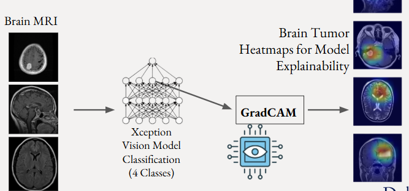
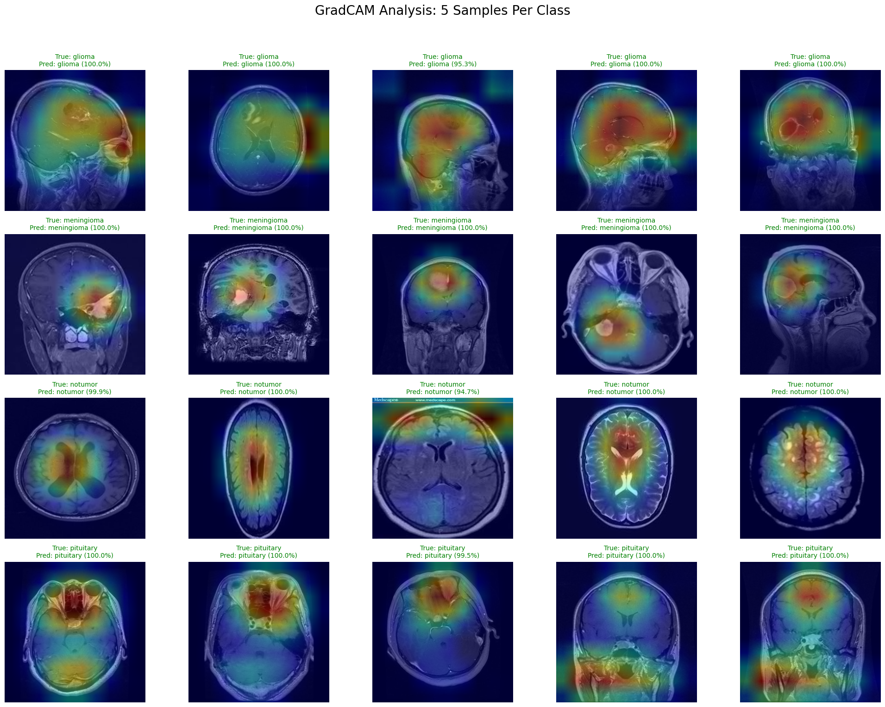

# GradCAM-in-Brain-Tumor-Classification

[](https://colab.research.google.com/github/U1186204/GradCAM-in-Brain-Tumor-Classification/blob/main/main.ipynb)
[](https://github.com/U1186204/GradCAM-in-Brain-Tumor-Classification/tree/main)
[](https://youtu.be/1YQFioh3gPY)

## Abstract
This project implements an Explainable AI (XAI) solution for classifying brain MRI scans into four tumor categories: Glioma, Meningioma, No Tumor, and Pituitary. Leveraging a pre-trained Xception model for feature extraction, the system achieves high classification accuracy while simultaneously generating GradCAM (Gradient-weighted Class Activation Mapping) heatmaps. These visualizations provide critical transparency by highlighting the specific anatomical regions the model focuses on—such as the sella turcica for pituitary tumors or tissue texture for gliomas—bridging the gap between "black box" deep learning predictions and clinical interpretability.


<div align="center">
  <h3>Video</h3>
  <a href="https://youtu.be/1YQFioh3gPY" target="_blank">
    
  </a>
  <p><i>Click the image above to watch the demonstration on YouTube.</i></p>
</div>


## Project Tree
```bash
GRADCAM-IN-BRAIN-TUMOR-CLASSIFICATION
├── .github/
│   └── workflows/
│       └── ci.yml
├── images/
│   ├── architecture.png
│   └── results.png
├── Dockerfile
├── LICENSE
├── llm_log.txt
├── main.ipynb
├── README.md
└── requirements.txt
```

## Project Architecture
The model architecture is based on Xception, a deep convolutional neural network pre-trained on ImageNet. We utilize the convolutional base as a feature extractor, freezing its weights to retain learned visual patterns. A custom classification head is added, consisting of a Flatten layer, Dropout layers for regularization, and Dense layers culminating in a Softmax output for the four target classes. The GradCAM algorithm accesses the final convolutional layer (block14_sepconv2_act) to compute the gradients of the predicted class score with respect to the feature maps, generating the visual explanation.



## Project Results
The model demonstrates strong performance metrics across all four classes, indicating reliability in distinguishing between different tumor types. The GradCAM visualizations confirm that the model is learning relevant features rather than background noise. Heatmaps for Meningiomas consistently localize the tumor mass, while "No Tumor" classifications show a diffuse attention pattern across healthy tissue.

| Metric | Value |
| :--- | :--- |
| **Test Accuracy** | ~99.5% |
| **Test Loss** | 0.0421 |
| **Precision** | 0.9948 |
| **Recall** | 0.9935 |

## Takeaways
This project demonstrates that transfer learning with Xception is highly effective for medical image classification. The addition of GradCAM proves that high accuracy models are making decisions based on medically relevant features, fostering trust in Machine Learning diagnostics. Verifying "where" the model is looking allows for rapid validation of predictions and helps identify errors in the model's reasoning process.




## Citations
Kaggle Notebook: Mohamed, Y. (2023). Brain tumor MRI Accuracy 99% [Kaggle Notebook]. Retrieved from https://www.kaggle.com/code/yousefmohamed20/brain-tumor-mri-accuracy-99/notebook

Viso.ai Blog Post: Boesch, G. (2024, May 16). Xception Model: Analyzing Depthwise Separable Convolutions. Viso.ai. Retrieved from https://viso.ai/deep-learning/xception-model/

BMC Medical Imaging Article: Musthafa, M. M., Mahesh, T. R., Vinoth Kumar, V., & Guluwadi, S. (2024). Enhancing brain tumor detection in MRI images through explainable AI using Grad-CAM with Resnet 50. BMC Medical Imaging, 24(107). https://doi.org/10.1186/s12880-024-01292-7
